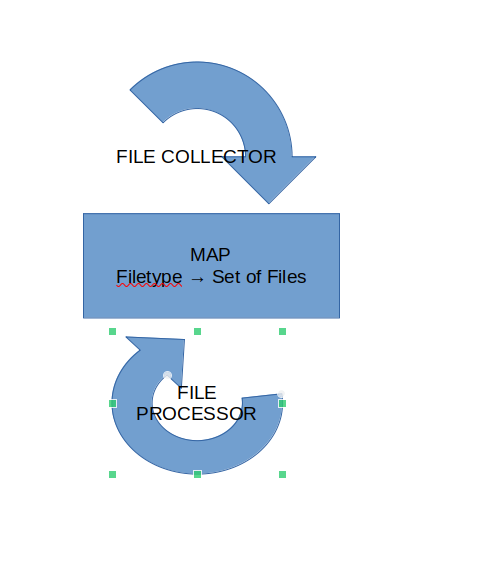

# FILE PROCESSING
This app read files from a well known folder (/home/guser/fileset) a process them in individual processors for each type of file. 

The use can specify the list of file's type the application should process. After the processing, the processed files are
moved to a folder which is specified too as arguments at the application start. 

There is the possibility to tune by specifying a buffer per type. This is a way to limit the memory usage when working a lot of files. 

USAGE
- file types: To specify a file type to process, use the option '-t' or '--file-types' followed by a value. This value can have 2 forms:
  - *FileType*: The value represents the file type (i.e: png, jpeg or pdf)
  - *FileType-Buffer*: The value represents the file type and the buffer to tune the processing. "png-100" means that png-files will be processed and a buffer will reach maximum 100 files in memory. If the buffer is not specified then there will be no limit to the buffer
- output: The option's short form here is '-o' (long form '--option') followed by a full path to a folder. The processed files will be moved inside this folder. 

The reporting (list of processed files per type) are located in the folder *<output-dir>/__LOGS__*. 

## THE SOLUTION
The implemented solution tries to address following the technical requirement:
- Ability to process millions of files
- The possibility to tune according the available hardware resources.

At the top level (see the picture above), the solution is composed of the following components:
- The Buffer: It is a thead safe Map object. It maps the file-type to thread safe instance of "Set"
- FileCollector: It is class implementing the Runnable-interface. It is characterized by the file type (i.e png) it handles, the maximal buffer's size. It iterates over the files inside the directory '/home/guser/fileset', filter them by type and put them in buffer. At runtime there is one instance of FileCollector per file type to process.
- FileProcessor: It implements also the Runnable interface. It is characterized by the handled file type. It processes the files repeatedly, and update the corresponding reports files. At runtime there is one instance of FileProcessor per file type to process.

## TESTS

This solution has been implemented following the TDD philosophy. The major classes FileProcessor, FileCollector and ArgumentsReader have been unit tested. 
At the beginning the E2E test (class MainTest) has been first written. IT basically generate 1 million files in the folder "/home/guser/fileset" and then launch the application with the following parameters:
- -t png-500 : process png-files with max 500 png files loaded in memory at any moment of time
- -t txt-1000 : process txt-files with max 1000 txt files loaded in memory at any moment of time
- -t jpg-500 : process png-files with max 500 jpg files loaded in memory at any moment of time

The tests are ready to be run (gradle test). Since the project is gradle one, it will be necessary to first load it accordingly in an IDE